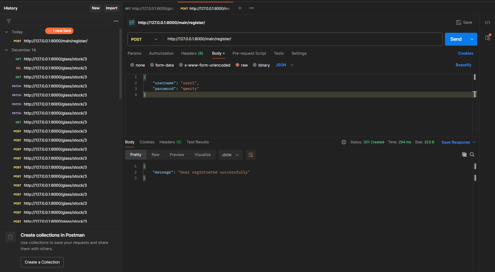
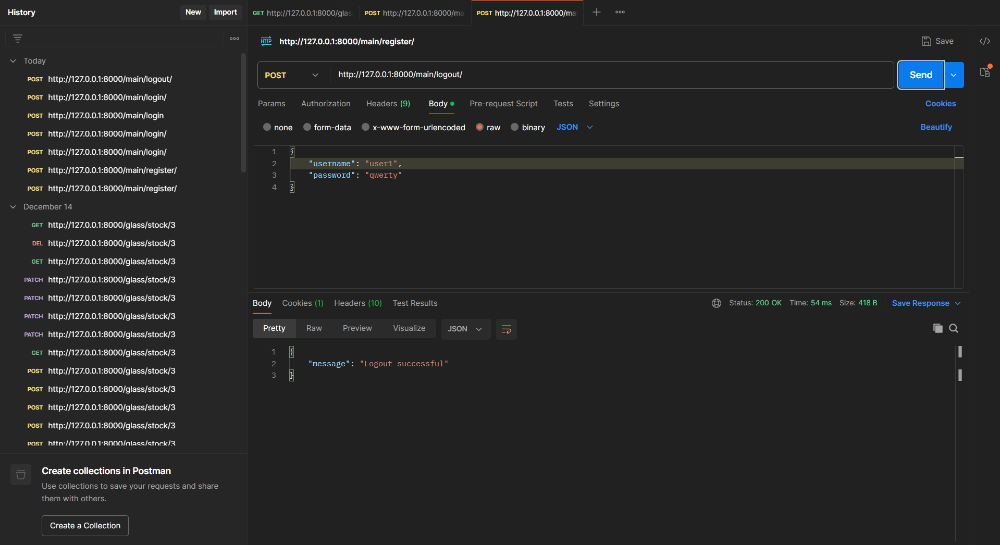
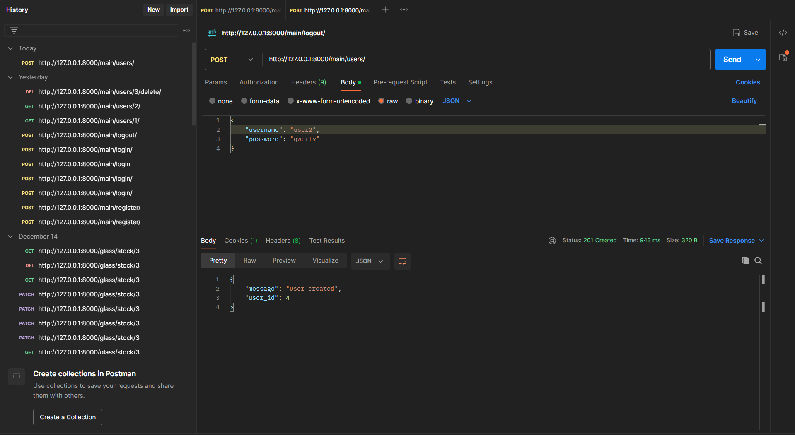
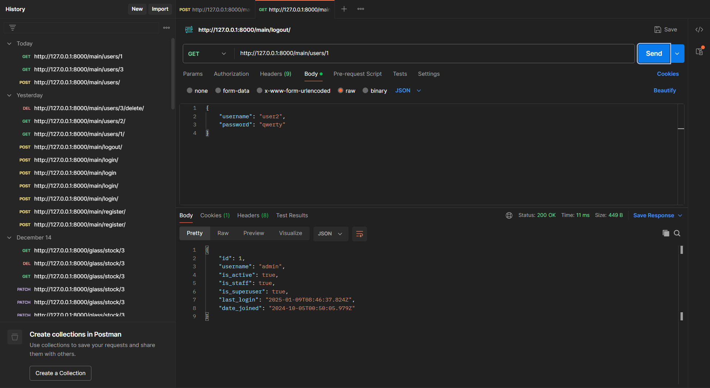
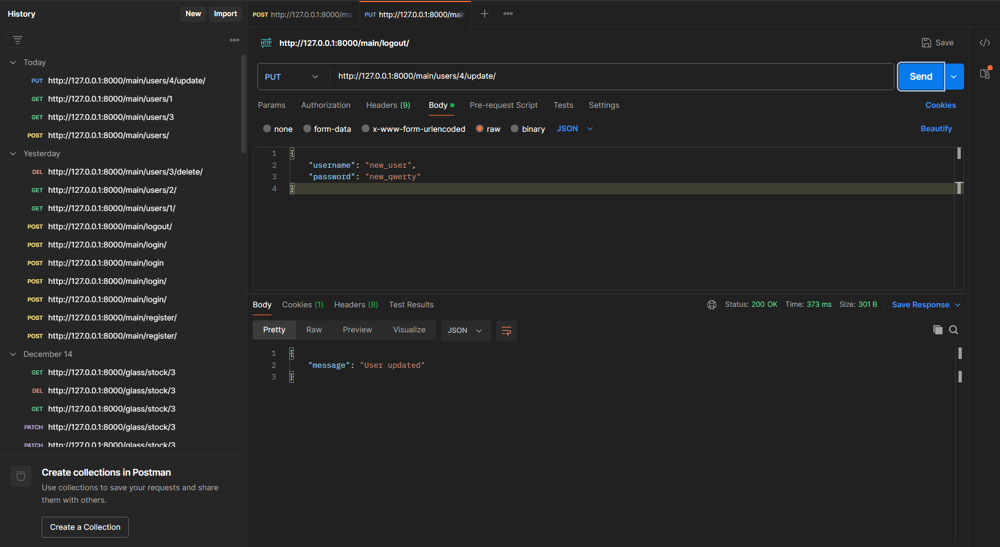

# Back-end

В лабе №1, сервак был запущен на специфическом IP и порте, путем добавления в конце команды "python manage.py runserver" IPv4:8080, где 
1) IPv4 -- локальный IP-адрес
2) 8080 - нестандартный порт

Скрины из Postman'а для лабы №4:

Скрины из Postman'а для лабы №5:

Лабораторная №6:

Сервер gateway, (находится в другой репе), был запущен на http://127.0.0.1:8000
В свою очередь основной сервер, то есть этот, был запущен на http://127.0.0.1:8001, были протестированы
на работоспособность все методы views.py основного сервера через запросы в POSTMAN с сервера gateway

