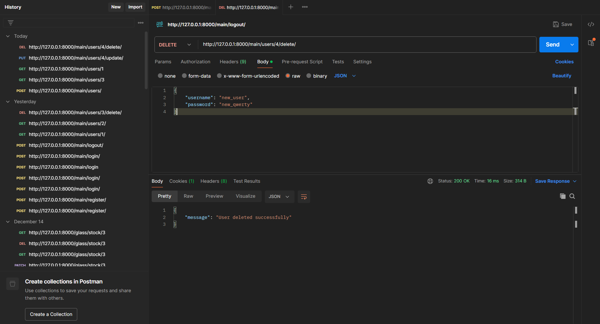

# Back-end

В лабе №1, сервак был запущен на специфическом IP и порте, путем добавления в конце команды "python manage.py runserver" IPv4:8080, где 
1) IPv4 -- локальный IP-адрес
2) 8080 - нестандартный порт

Скрины из Postman'а для лабы №4:

Скрины из Postman'а для лабы №5:

